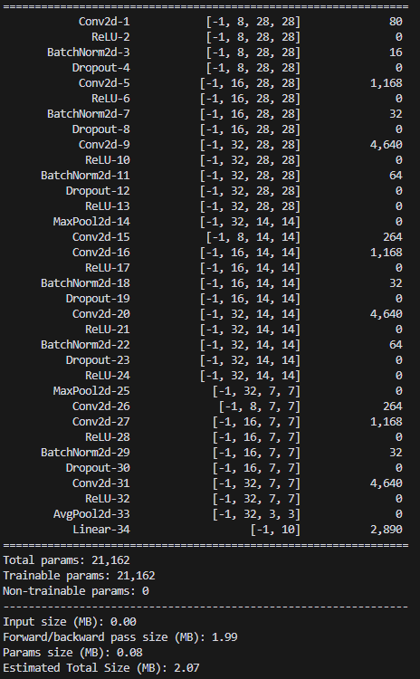
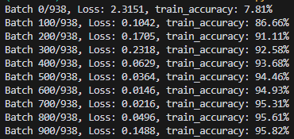
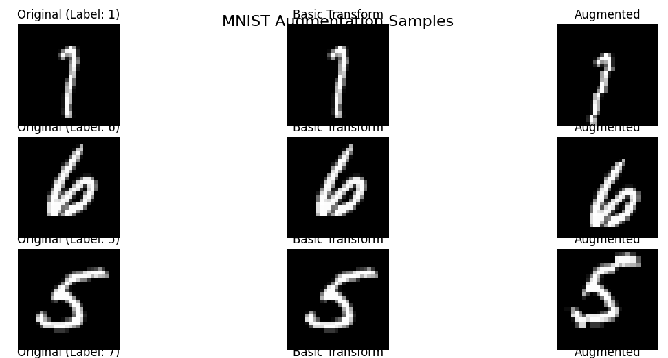

## Objective

Make a MNIST based model that has following characteristics:
 - Has less than 25000 parameters
 - Gets to training accuracy of 95% or more in 1 Epoch
 - Once done, upload to GitHub "with actions". On actions you should be testing for:
    - Model has less than 25000 parameters
    - Has accuracy of more than 95% in 1 Epoch
    - Add image augmentations
    - Add three or more relevant tests
    - Add Build Pass Badge

## MNIST Model Architecture

## MNIST Model Training Logs

## Tests Conducted
 - Test Model Architecture - Accepts input of shape (1, 1, 28, 28)
 - Test Model Parameters - Less than 25000 parameters
 - Test Model Accuracy - More than 95% in 1 Epoch
 - Test Model Forward - Accepts different batch sizes
 - Test model output range - Outputs are in valid probability range after softmax & sum to 1
 - Test model gradients - Gradients are properly computed
 - Test model input validation - Raises error for invalid input shapes

## Image Augmentations

    transforms.RandomRotation(degrees=5),      # Slight rotation (reduced from 15 to 10 degrees)
    transforms.RandomAffine(
        degrees=0,                             # No rotation in affine transform
        translate=(0.05, 0.05),                  # Random translation up to 10%
        scale=(0.95, 1.05)                       # Random scaling between 90% and 110%
        ),
    transforms.GaussianBlur(
        kernel_size=3,                         # Blur kernel size
        sigma=(0.01, 0.02)                       # Random sigma for blur
        )

## Augmented Image Samples

